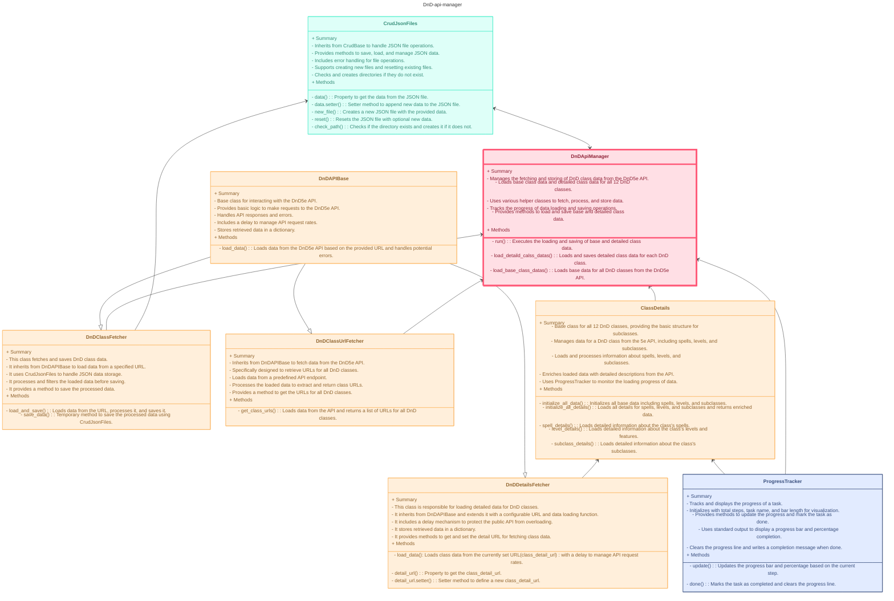
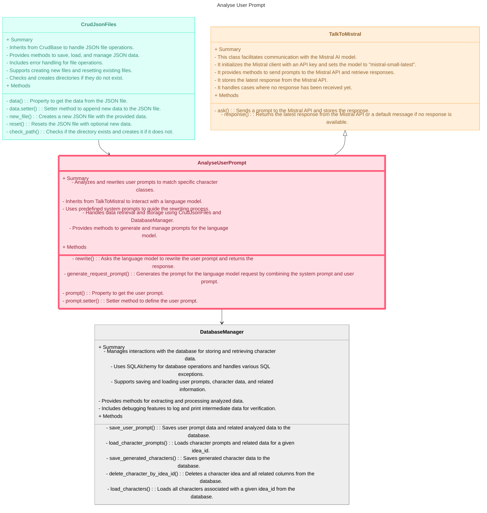
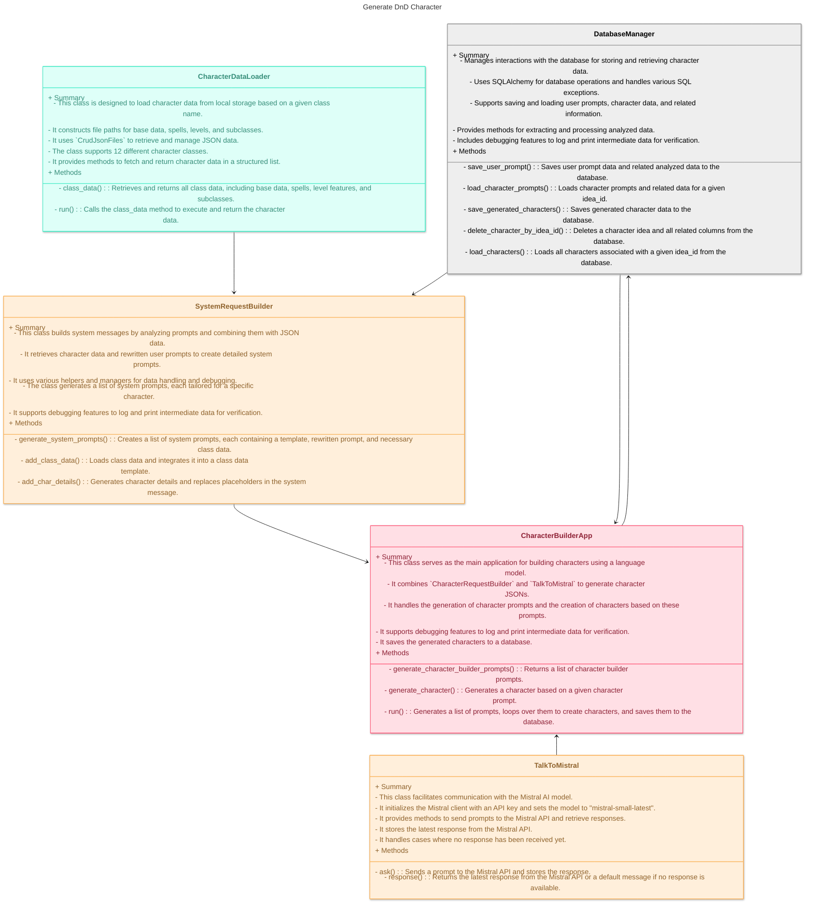

# DnD Character Generator mit AI funktion

## Beschreibung

Mit diesem Projekt kann man sich DnD-Charactere erstellen lassen. 
Dafür gibt man dem Programm einen einfachen Satz oder eine Beschreibung des gewünschten Characters. 

Z.B 'Conan der Barbar'.

Das Programm wird dann, auf Basis der Eingabe, vier verschiedene Charactere erstellen, die auf die Beschreibung passen. 

Bei 'Conan der Barbar' würde z.B ein Barbar, ein Fighter und ein Ranger als mögliche Charactere herauskommen. 

## Programm Aufbau

Der DnD Character generator besteht aus drei Teilen, die auch in Api-Endpunkten aufgeteilt sind.

**1. Load Class Datas (GET)**

Der DnD Character generator muss erst alle nötigen Daten von der DnD5e-api ziehen. Dafür gibt es einen eigenen 'Loader'.
Der 'Loader' wird weiter unten näher beschrieben

**2. Analyse User Promt (POST)**


Die Beschreibung des Users, für einen Character muss erst einmal für das LLM aufbereitet werden. Dafür werden aus dem User Promt folgende Informationen herausgezogen:
- Alle drei möglichen Klassen
- Alle Wörter, die die Besonderen Eigenschaften der Characterbeschreibung darstellen. Z.B 'Stark', 'Berserker', 'Feuer', 'Mächtig', etc...
- Drei Varianten des User Prompts, aber mit den jeweiligen Klassen eingesetzt.

Beispiel

```JSON
{
"user_prompt": "Aang aus 'Avatar - the last airbender'",
"answer": {
    "matched_classes": ["monk", "ranger", "fighter"], 
    "keywords": ["Aang, Avatar, Luftb\u00e4ndiger, Bender, Kampf, Bewegung, Gleichgewicht"],
    "rewritten_prompt_template": ["Aang aus 'Avatar - the last airbender' als monk", "Aang aus 'Avatar - the last airbender' als ranger", "Aang aus 'Avatar - the last airbender' als fighter"]
    }
  }
```

**3. Generate Character (POST)**

Anhand der generierten Daten aus dem User Promt werden nun vier Charactere erstellt. 2x Charactere mit der 'besten' Klassen Wahl. Dies ist die erste Klasse in der Liste 'machted_classes'. Dann noch jeweils ein Charcter mit den beiden anderen Klassen.
Die Genertierten Charactere werden jeweils als JSON-Struktur ausgegeben und in der SQLite Datenbank gespeichert. 


## Programm-Struktur

```txt
main
| data
--| db
----|dnd_character_projekt.sqlite
--| debug_data
----|debug.log
--| llm_data
----|all_class_data_template.txt
----|system_message.txt
--| static_dnd_data
----| detailed_class_data
------| ...
----|all_classes.json
----|class_indizies.json
| src
--| api_endpoints
----|get_and_post_endpoints.py
----|get_endpoints.py
----|post_endpoints.py
--| database
----|db_creator.py
----|db_manager.py
----|models.py
--| dnd_api
----| base_classes
------| dnd_api_base.py
----|class_details.py
----|class_url_fetcher.py
----|dnd_api_manager.py
----|dnd_class_fether.py
----|dnd_details_fetcher.py
--| handle_data
----|character_data_loader.py
----|crud_base.py
----|crud_json.py
----|crud_txt.py
----|env_loader.py
--| helper
----| binary_algorythm
------|binary_base.py
------|bianry_dict.py
----|debug_helper.py
----|debug_log.py
----|progress_tracker.py
--| LLM
----|analyse_user_prompt.py
----|character_builder_app.py
----|system_request_builder.py
----|talk_to_mistral.py
--|app.py
|.env
|README.md
```

Im folgenden werde ich die einzelnen Module erklären.

Die Reihenfolge wird sein:

1. ```dnd_api```
2. ```llm```
   1. ```analyse user prompt```
   2. ```character builder app```


### dnd_api

Das dnd_api modul ist dafür zuständig alle Daten der 12 DnD-Klassen von der DnD5e-api herunter zu laden und lokal als JSON zu speichern. 
Für jede Klasse wird ein eigenes JSON-file angelegt, welches alle ```Spells```, ```level_features``` und ```subclass_features``` enthält.



### llm

Das llm-modul besteht aus zwei Anwendungen. 
1. Der Analyse des User Prompts
2. Die Generierung eines DnD Characters

**Analyse eines User Prompts**


**Generierung eines DnD Characters**



