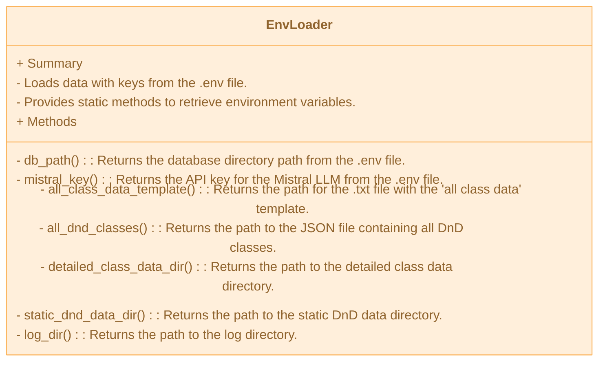

from kombu.compression import zstd_compress

# DnD Character Generator with AI Functionality

## Description

This project allows you to create DnD characters. 
You provide the program with a simple sentence or a description of the desired character, e.g., 'Conan the Barbarian'. 
The program will then generate four different characters based on the input. 
For 'Conan the Barbarian', for example, a barbarian, a fighter, and a ranger might be suggested as possible characters.

## Program Structure

```txt
Programm structure

main/
├── data/
│   ├── db/
│   │   └── dnd_generator_database.sqlite
│   ├── debug_data/
│   │   ├── debug.log
│   │   ├── api.log
│   │   ├── data_handler.log
│   │   ├── db.log
│   │   ├── dnd_api.log
│   │   ├── llm.log
│   │   └── tracker.log
│   ├── llm_data/
│   │   └── all_class_data_template.txt
│   └── static_dnd_data/
│       ├── detailed_class_data/
│       │   └── ...detailed data for each class...
│       ├── all_classes.json
│       └── class_indizies.json
├── src/
│   ├── api_endpoints/
│   │   ├── get_and_post_endpoints.py
│   │   ├── get_endpoints.py
│   │   └── post_endpoints.py
│   ├── database/
│   │   ├── db_creator.py
│   │   ├── db_manager.py
│   │   └── models.py
│   ├── dnd_api/
│   │   ├── base_classes/
│   │   │   └── dnd_api_base.py
│   │   ├── class_details.py
│   │   ├── class_url_fetcher.py
│   │   ├── dnd_api_manager.py
│   │   ├── dnd_class_fetcher.py
│   │   └── dnd_details_fetcher.py
│   ├── handle_data/
│   │   ├── base_classes/
│   │   │   └── crud_base.py
│   │   ├── character_data_loader.py
│   │   ├── crud_json.py
│   │   ├── crud_txt.py
│   │   └── env_loader.py
│   ├── helper/
│   │   ├── logger.py
│   │   └── progress_tracker.py
│   ├── LLM/
│   │   ├── base_classes/
│   │   │   └── talk_to_mistral.py
│   │   ├── analyse_user_prompt.py
│   │   ├── character_builder_app.py
│   │   └── system_request_builder.py
│   └── app.py
├── .env.template
├── .env (needs to be created)
├── README.md
└── requirements.txt
```

## Installation Instructions

Installation Instructions
To set up the project, follow these steps:

Clone the repository:
```shell
git clone <repository-url>
```

Navigate to the project directory:
```shell
cd your_repository_path/dnd-character-generator
```

Create a virtual environment:
```shell
python -m venv venv
```

Activate the virtual environment:

On Windows:
```shell
.\venv\Scripts\activate
```

On macOS/Linux:
```shell
source venv/bin/activate
```

Install the required dependencies:
```shell
pip install -r requirements.txt
```

## Requirements

Python 3.8 or higher
Required Python packages (listed in requirements.txt)

## Environment Setup

To configure the .env file, follow these steps:

Create a .env file in the root directory of the project.

Add the following environment variables to the .env file; also see the `.env.template` file:

```text
# Database Path
DB_PATH = 'your-database-url-here'

# Mistral AI Key
MISTARL_API_KEY = 'your-mistral-key-here'

# All classes template
ALL_CLASS_TEMPLATE = 'your-all_classes_template_path-here'

# DnD data paths

ALL_DND_CLASSES = 'your-all_dnd_classes_path-here'
DETAILED_CLASS_DATA_DIR = 'your-detailed_class_data_path-here'
STATIC_DND_DATA_DIR = 'your-static_dnd_data_path-here'

# Log-dir
LOG_DIR = 'your-log_dir_path-here'
```

Save the .env file.

the `env_loader.py` module will load automaticly the data form the created `.env` file

## Database Setup

To initialize the database, follow these steps:

Ensure you have SQLite installed.

Run the database initialization script:
````shell
python src/database/db_creator.py
````

This script will create the necessary tables and set up the database schema.

The database_path has to be set in the `.env` file. Without an database_path in the `.env` file, there will be an `ERROR`. 

## API Documentation

**Load Class Datas (GET)**  

`Important!!!`: Before you run the `Generate Character` API-endpoint, you have to download the dnd_class_data from the DnD5e-api.

The `Load Class Data` fetches all necessary data from the DnD5e API. For this, there is a separate 'Loader'. The 'Loader' is described in more detail below.

**Analyze User Prompt (POST)**  

The user's description of a character must first be prepared for the LLM. For this, the following information is extracted from the user prompt:

- All three possible classes
- All words that represent the special characteristics of the character description, e.g., 'Strong', 'Berserker', 'Fire', 'Powerful', etc.
- Three variants of the user prompt, but with the respective classes inserted.

Example:
```JSON
{
  "user_prompt": "Aang from 'Avatar - the last airbender'",
  "answer": {
    "matched_classes": ["monk", "ranger", "fighter"],
    "keywords": ["Aang, Avatar, Airbender, Bender, Combat, Movement, Balance"],
    "rewritten_prompt_template": [
      "Aang from 'Avatar - the last airbender' as a monk",
      "Aang from 'Avatar - the last airbender' as a ranger",
      "Aang from 'Avatar - the last airbender' as a fighter"
    ]
  }
}
```

**Generate Character (POST)**  

Based on the generated data from the user prompt, four characters are now created. 
2x characters with the 'best' class choice, which is the first class in the 'matched_classes' list. 
Then one character each with the other two classes. 
The generated characters are each output as a JSON structure and stored in the SQLite database.

## Usage Examples

**get_dnd_data_from_DnDapi**

Curl:
````curl
curl http://localhost:5000/get_dnd_data_from_DnDapi
````


Pyhton:

````python

import requests

# loads all dnd_class_data from DnD5e-api; no return
requests.get('http://localhost:5000/get_dnd_data_from_DnDapi')
````

**rewrite_user_prompt**

Curl:

````curl
curl -X 'POST' \
  'http://localhost:5000/rewrite_user_prompt/?user_prompt=Lancelot%20aus%20%60die%20Arthus%20sage%60' \
  -H 'accept: application/json' \
  -d ''
````

Python:

````python
import requests
from urllib.parse import quote

# set 'user_prompt'
user_prompt = "Donkey Kong aus Super Mario, aber mit einem großen Bananenschwert."

# decode 'user_prompt' for url
encoded_prompt = quote(user_prompt)

# takes user_prompt as argument and rewrites it for the usage of character_generation; response is optional
response = requests.get(f'http://localhost:5000/rewrite_user_prompt/?user_prompt={user_prompt}')

# print response, if you like; responste is saved automaticly in the database
print(response)
````

**generate_character**

Generates four characters on base of the rewritten_userprompt.

Curl:
````curl
curl -X 'GET' \
  'http://localhost:5000/characters/generate?user_prompt_id=1' \
  -H 'accept: application/json'
````

Python:

````python
import requests

# primary_key from the user_prompt in 'rewrite_user_prompt'; 
# with this primary_key, the rewritten_prompts are lodes from the database and the LLM can generate the character from that
user_prompt_id = 1

# generated character is automaticlay saved in database
response = requests.get(f'http://localhost:5000/characters/generate?user_prompt_id={user_prompt_id}')

#optional:
print(response)
````

**get_characters**

Gets all four generated Characters by the primary_key 'user_prompt_id''

Curl:
````curl
curl -X 'GET' \
  'http://localhost:5000/characters/get?user_prompt_id=1' \
  -H 'accept: application/json'
````

Python:

````python
import requests

# primary_key from the user_prompt in 'rewrite_user_prompt'; 
user_prompt_id = 1

# gets all four characters with the foreing_key 'user_prompt_id'
response = requests.get(f'http://localhost:5000/characters/get?user_prompt_id={user_prompt_id}')

#optional:
print(response)
````

## Dependencies

This project relies on several key Python packages, including:

**FastAPI**: For building the API endpoints.

**SQLAlchemy**: For database interactions.

**MistralAI**: For AI-based character generation.

**Requests**: For making HTTP requests.

For a complete list of dependencies, please refer to the `requirements.txt` file.

**Installation**

To install the required dependencies, run the following command:

```curl
pip install -r requirements.txt

```

## Modules


### dnd_api
The dnd_api module is responsible for downloading all data of the 12 DnD classes from the DnD5e API and saving them locally as JSON. For each class, a separate JSON file is created, which contains all `Spells`, `level_features`, and `subclass_features`.

```mermaid
---title: DnD-api-manager---
classDiagram
direction TB
    class DnDAPIBase {
        + Summary
        - Base class for interacting with the DnD5e API.
        - Provides basic logic to make requests to the DnD5e API.
        - Handles API responses and errors.
        - Includes a delay to manage API request rates.
        - Stores retrieved data in a dictionary.
        + Methods
        - load_data() : Loads data from the DnD5e API based on the provided URL and handles potential errors.
    }
    class DnDDetailsFetcher {
        + Summary
        - This class is responsible for loading detailed data for DnD classes.
        - It inherits from DnDAPIBase and extends it with a configurable URL and data loading function.
        - It includes a delay mechanism to protect the public API from overloading.
        - It stores retrieved data in a dictionary.
        - It provides methods to get and set the detail URL for fetching class data.
        + Methods
        - load_data(): Loads class data from the currently set URL(class_detail_url) with a delay to manage API request rates.
        - detail_url() : Property to get the class_detail_url.
        - detail_url.setter() : Setter method to define a new class_detail_url.
    }
    class DnDClassFetcher {
        + Summary
        - This class fetches and saves DnD class data.
        - It inherits from DnDAPIBase to load data from a specified URL.
        - It uses CrudJsonFiles to handle JSON data storage.
        - It processes and filters the loaded data before saving.
        - It provides a method to save the processed data.
        + Methods
        - load_and_save() : Loads data from the URL, processes it, and saves it.
        - save_data() : Temporary method to save the processed data using CrudJsonFiles.
    }
    class DnDClassUrlFetcher {
        + Summary
        - Inherits from DnDAPIBase to fetch data from the DnD5e API.
        - Specifically designed to retrieve URLs for all DnD classes.
        - Loads data from a predefined API endpoint.
        - Processes the loaded data to extract and return class URLs.
        - Provides a method to get the URLs for all DnD classes.
        + Methods
        - get_class_urls() : Loads data from the API and returns a list of URLs for all DnD classes.
    }
    class ClassDetails {
        + Summary
        - Base class for all 12 DnD classes, providing the basic structure for subclasses.
        - Manages data for a DnD class from the 5e API, including spells, levels, and subclasses.
        - Loads and processes information about spells, levels, and subclasses.
        - Enriches loaded data with detailed descriptions from the API.
        - Uses ProgressTracker to monitor the loading progress of data.
        + Methods
        - initialize_all_data() : Initializes all base data including spells, levels, and subclasses.
        - initialize_all_details() : Loads all details for spells, levels, and subclasses and returns enriched data.
        - spell_details() : Loads detailed information about the class's spells.
        - level_details() : Loads detailed information about the class's levels and features.
        - subclass_details() : Loads detailed information about the class's subclasses.
    }
    class DnDApiManager {
        + Summary
        - Manages the fetching and storing of DnD class data from the DnD5e API.
        - Loads base class data and detailed class data for all 12 DnD classes.
        - Uses various helper classes to fetch, process, and store data.
        - Tracks the progress of data loading and saving operations.
        - Provides methods to load and save base and detailed class data.
        + Methods
        - run() : Executes the loading and saving of base and detailed class data.
        - load_detaild_calss_datas() : Loads and saves detailed class data for each DnD class.
        - load_base_class_datas() : Loads base data for all DnD classes from the DnD5e API.
    }
    class ProgressTracker {
        + Summary
        - Tracks and displays the progress of a task.
        - Initializes with total steps, task name, and bar length for visualization.
        - Provides methods to update the progress and mark the task as done.
        - Uses standard output to display a progress bar and percentage completion.
        - Clears the progress line and writes a completion message when done.
        + Methods
        - update() : Updates the progress bar and percentage based on the current step.
        - done() : Marks the task as completed and clears the progress line.
    }
    class CrudJsonFiles {
        + Summary
        - Inherits from CrudBase to handle JSON file operations.
        - Provides methods to save, load, and manage JSON data.
        - Includes error handling for file operations.
        - Supports creating new files and resetting existing files.
        - Checks and creates directories if they do not exist.
        + Methods
        - data() : Property to get the data from the JSON file.
        - data.setter() : Setter method to append new data to the JSON file.
        - new_file() : Creates a new JSON file with the provided data.
        - reset() : Resets the JSON file with optional new data.
        - check_path() : Checks if the directory exists and creates it if it does not.
    }
    DnDAPIBase --|> DnDDetailsFetcher
    DnDAPIBase --|> DnDClassFetcher
    DnDAPIBase --|> DnDClassUrlFetcher
    ClassDetails <-- DnDDetailsFetcher
    ClassDetails <-- ProgressTracker
    DnDApiManager <-- ClassDetails
    DnDApiManager <-- DnDClassFetcher
    DnDApiManager <-- DnDClassUrlFetcher
    DnDApiManager <-- ProgressTracker
    CrudJsonFiles <--> DnDApiManager
    CrudJsonFiles <-- DnDClassFetcher
    class DnDAPIBase:::Peach
    class DnDDetailsFetcher:::Peach
    class DnDClassFetcher:::Peach
    class DnDClassUrlFetcher:::Peach
    class ClassDetails:::Peach
    class DnDApiManager:::Rose
    class ProgressTracker:::Sky
    class CrudJsonFiles:::Aqua
    classDef Rose :, stroke-width:5px, stroke-dasharray:none, stroke:#FF5978, fill:#FFDFE5, color:#8E2236
    classDef Aqua :, stroke-width:1px, stroke-dasharray:none, stroke:#46EDC8, fill:#DEFFF8, color:#378E7A
    classDef Peach :, stroke-width:1px, stroke-dasharray:none, stroke:#FBB35A, fill:#FFEFDB, color:#8F632D
    classDef Sky :,stroke-width:1px, stroke-dasharray:none, stroke:#374D7C, fill:#E2EBFF, color:#374D7C
```

### llm
The llm module consists of two applications:
1. Analysis of the User Prompt
2. Generation of a DnD Character

**Analysis of a User Prompt**
```mermaid
---title: Analyse User Prompt---
classDiagram
direction TB
    class AnalyseUserPrompt {
        + Summary
        - Analyzes and rewrites user prompts to match specific character classes.
        - Inherits from TalkToMistral to interact with a language model.
        - Uses predefined system prompts to guide the rewriting process.
        - Handles data retrieval and storage using CrudJsonFiles and DatabaseManager.
        - Provides methods to generate and manage prompts for the language model.
        + Methods
        - rewrite() : Asks the language model to rewrite the user prompt and returns the response.
        - generate_request_prompt() : Generates the prompt for the language model request by combining the system prompt and user prompt.
        - prompt() : Property to get the user prompt.
        - prompt.setter() : Setter method to define the user prompt.
    }
    class DatabaseManager {
        + Summary
        - Manages interactions with the database for storing and retrieving character data.
        - Uses SQLAlchemy for database operations and handles various SQL exceptions.
        - Supports saving and loading user prompts, character data, and related information.
        - Provides methods for extracting and processing analyzed data.
        - Includes debugging features to log and print intermediate data for verification.
        + Methods
        - save_user_prompt() : Saves user prompt data and related analyzed data to the database.
        - load_character_prompts() : Loads character prompts and related data for a given idea_id.
        - save_generated_characters() : Saves generated character data to the database.
        - delete_character_by_idea_id() : Deletes a character idea and all related columns from the database.
        - load_characters() : Loads all characters associated with a given idea_id from the database.
    }
    class TalkToMistral {
        + Summary
        - This class facilitates communication with the Mistral AI model.
        - It initializes the Mistral client with an API key and sets the model to "mistral-small-latest".
        - It provides methods to send prompts to the Mistral API and retrieve responses.
        - It stores the latest response from the Mistral API.
        - It handles cases where no response has been received yet.
        + Methods
        - ask() : Sends a prompt to the Mistral API and stores the response.
        - response() : Returns the latest response from the Mistral API or a default message if no response is available.
    }
    class CrudJsonFiles {
        + Summary
        - Inherits from CrudBase to handle JSON file operations.
        - Provides methods to save, load, and manage JSON data.
        - Includes error handling for file operations.
        - Supports creating new files and resetting existing files.
        - Checks and creates directories if they do not exist.
        + Methods
        - data() : Property to get the data from the JSON file.
        - data.setter() : Setter method to append new data to the JSON file.
        - new_file() : Creates a new JSON file with the provided data.
        - reset() : Resets the JSON file with optional new data.
        - check_path() : Checks if the directory exists and creates it if it does not.
    }
    CrudJsonFiles --> AnalyseUserPrompt
    TalkToMistral <|-- AnalyseUserPrompt
    AnalyseUserPrompt --> DatabaseManager
    class AnalyseUserPrompt:::Rose
    class DatabaseManager:::Ash
    class TalkToMistral:::Peach
    class CrudJsonFiles:::Aqua
    classDef Rose :, stroke-width:5px, stroke-dasharray:none, stroke:#FF5978, fill:#FFDFE5, color:#8E2236
    classDef Ash :, stroke-width:1px, stroke-dasharray:none, stroke:#999999, fill:#EEEEEE, color:#000000
    classDef Aqua :, stroke-width:1px, stroke-dasharray:none, stroke:#46EDC8, fill:#DEFFF8, color:#378E7A
    classDef Peach :,stroke-width:1px, stroke-dasharray:none, stroke:#FBB35A, fill:#FFEFDB, color:#8F632D
```

**Generation of a DnD Character**
```mermaid
---config: look: neo theme: base---
title: Generate DnD Character
classDiagram
direction TB
    class DatabaseManager {
        + Summary
        - Manages interactions with the database for storing and retrieving character data.
        - Uses SQLAlchemy for database operations and handles various SQL exceptions.
        - Supports saving and loading user prompts, character data, and related information.
        - Provides methods for extracting and processing analyzed data.
        - Includes debugging features to log and print intermediate data for verification.
        + Methods
        - save_user_prompt() : Saves user prompt data and related analyzed data to the database.
        - load_character_prompts() : Loads character prompts and related data for a given idea_id.
        - save_generated_characters() : Saves generated character data to the database.
        - delete_character_by_idea_id() : Deletes a character idea and all related columns from the database.
        - load_characters() : Loads all characters associated with a given idea_id from the database.
    }
    class CharacterDataLoader {
        + Summary
        - This class is designed to load character data from local storage based on a given class name.
        - It constructs file paths for base data, spells, levels, and subclasses.
        - It uses `CrudJsonFiles` to retrieve and manage JSON data.
        - The class supports 12 different character classes.
        - It provides methods to fetch and return character data in a structured list.
        + Methods
        - class_data() : Retrieves and returns all class data, including base data, spells, level features, and subclasses.
        - run() : Calls the class_data method to execute and return the character data.
    }
    class SystemRequestBuilder {
        + Summary
        - This class builds system messages by analyzing prompts and combining them with JSON data.
        - It retrieves character data and rewritten user prompts to create detailed system prompts.
        - It uses various helpers and managers for data handling and debugging.
        - The class generates a list of system prompts, each tailored for a specific character.
        - It supports debugging features to log and print intermediate data for verification.
        + Methods
        - generate_system_prompts() : Creates a list of system prompts, each containing a template, rewritten prompt, and necessary class data.
        - add_class_data() : Loads class data and integrates it into a class data template.
        - add_char_details() : Generates character details and replaces placeholders in the system message.
    }
    class CharacterBuilderApp {
        + Summary
        - This class serves as the main application for building characters using a language model.
        - It combines `CharacterRequestBuilder` and `TalkToMistral` to generate character JSONs.
        - It handles the generation of character prompts and the creation of characters based on these prompts.
        - It supports debugging features to log and print intermediate data for verification.
        - It saves the generated characters to a database.
        + Methods
        - generate_character_builder_prompts() : Returns a list of character builder prompts.
        - generate_character() : Generates a character based on a given character prompt.
        - run() : Generates a list of prompts, loops over them to create characters, and saves them to the database.
    }
    class TalkToMistral {
        + Summary
        - This class facilitates communication with the Mistral AI model.
        - It initializes the Mistral client with an API key and sets the model to "mistral-small-latest".
        - It provides methods to send prompts to the Mistral API and retrieve responses.
        - It stores the latest response from the Mistral API.
        - It handles cases where no response has been received yet.
        + Methods
        - ask() : Sends a prompt to the Mistral API and stores the response.
        - response() : Returns the latest response from the Mistral API or a default message if no response is available.
    }
    DatabaseManager --> SystemRequestBuilder
    CharacterDataLoader --> SystemRequestBuilder
    SystemRequestBuilder --> CharacterBuilderApp
    DatabaseManager --> CharacterBuilderApp
    DatabaseManager <-- CharacterBuilderApp
    CharacterBuilderApp <-- TalkToMistral
    style CharacterBuilderApp :,stroke-width:5px
    class DatabaseManager:::Ash
    class CharacterDataLoader:::Pine
    class CharacterDataLoader:::Aqua
    class SystemRequestBuilder:::Peach
    class CharacterBuilderApp:::Rose
    class TalkToMistral:::Peach
    classDef Ash :, stroke-width:1px, stroke-dasharray:none, stroke:#999999, fill:#EEEEEE, color:#000000
    classDef Rose :, stroke-width:1px, stroke-dasharray:none, stroke:#FF5978, fill:#FFDFE5, color:#8E2236
    classDef Peach :, stroke-width:1px, stroke-dasharray:none, stroke:#FBB35A, fill:#FFEFDB, color:#8F632D
    classDef Pine :, stroke-width:1px, stroke-dasharray:none, stroke:#254336, fill:#27654A, color:#FFFFFF
    classDef Aqua :,stroke-width:1px, stroke-dasharray:none, stroke:#46EDC8, fill:#DEFFF8, color:#378E7A
```
### database

The DataBaseManager is responsible for all datbase actions.

The class gets all Tables from `models.py`.

````mermaid
classDiagram
direction TB
    class DatabaseManager {
	    + Summary
	    - Manages interactions with a SQL database for a character creation system.
	    - Handles saving, loading, and deleting data related to user prompts, character ideas, classes, descriptions, and generated characters.
	    - Manages both production and test database connections.
	    - Provides functionality for data persistence and character management.
	    - Includes comprehensive error handling for database operations.
	    + Methods
	    - __init__(self, test_case=False, temp_engine=None) : Initializes the DatabaseManager in either test or normal mode.
	    - save_rewritten_data(self, prompt: str, analysed_dict) : Saves all generated data from the analyzing process of the user prompt.
	    - _save_user_prompt(self, prompt: str, session) : Saves user prompt in the database.
	    - _save_rewritten_prompts(self, new_user_prompt_id, rewritten_prompts, session) : Saves the rewritten user prompts in the database.
	    - _save_key_descriptions(self, key_descriptions, user_prompt_id, session: Session) : Saves the key descriptions from the user prompt in the database.
	    - _save_classes(self, possible_classes, new_user_prompt_id, session) : Saves the best fitting DnD classes for the user prompt in the database.
	    - extract_rewriten_data(self, analysed_dict) -> tuple: Extracts data from the dictionary and returns them as tuples.
	    - load_all_char_ideas(self): Loads all character ideas(user prompts) and returns them as a dictionary.
	    - load_character_prompts(self, user_prompt_id) : Loads all data from the analyzed user prompt for creating a system prompt for character creation.
	    - _load_rewritten_prompts(self, user_prompt_id, session) : Loads all rewritten prompts with the user prompt ID.
	    - _load_key_description_for_user_prompt(self, user_prompt_id, session) : Returns descriptions which have a key-key connection with the given user prompt ID.
	    - _load_classes_for_user_prompt(self, user_prompt_id, session) : Returns all class names from the Classes table which are True.
	    - save_generated_characters(self, characters: List[str], user_prompt_id) : Saves generated characters in the database.
	    - delete_character_by_user_prompt_id(self, user_prompt_id: int): Deletes a user prompt ID(user prompt) with all connected columns.
	    - load_characters(self, user_prompt_id: int) : Loads all four characters with the foreign key: user prompt ID.
	    - load_user_prompt_ids(self) : Loads all user prompt IDs from the database.
    }

	class DatabaseManager:::Peach

	classDef Peach :,stroke-width:1px, stroke-dasharray:none, stroke:#FBB35A, fill:#FFEFDB, color:#8F632D

````

### handle_data

the handle_data module has three diferent file-handler modules:

- crud_files -> responsible for all Json and .txt crud-operations in the hole projekt
- character_data_loader -> loads all class_data from the local storage
- env_loader -> loads the data from the .env file

**CrudFiles and CharacterDataLoader**
````mermaid
classDiagram
direction TB
    class CrudBase {
	    + Summary
	    - Abstract base class for handling CRUD operations for local data.
	    - Provides methods for saving, loading, and managing data in storage.
	    - Includes functionality for checking directories and managing file operations.
	    + Methods
	    - data: Abstract property to return the data from storage.
	    - data.setter: Abstract setter method to save new data to storage.
	    - __init__(self, data_path) : Initializes the CrudBase with a data path.
	    - _save(self, data) : Abstract method to save data in storage.
	    - new_file(self, new_data) : Saves data in a new file.
	    - reset(self, empty_data=None) : Resets a file to None or an empty data structure.
	    - check_dir(self) : Checks if a directory exists; if not, creates it.
	    - check_tries_of_i(self, error_message="tries_of_i is too high!!!", max_tries=3) : Checks the number of tries for directory creation and raises an error if exceeded.
    }

    class CrudJsonFiles {
	    + Summary
	    - Handles JSON CRUD operations.
	    - Extends CrudBase to provide specific implementations for JSON file operations.
	    + Methods
	    - data: Property to return the data from the JSON file.
	    - data.setter: Setter method to save new data to the JSON file.
	    - _save(self, data) : Saves data in a JSON file; creates a new file if it does not exist.
	    - new_file(self, new_data) : Saves data in a new JSON file.
	    - reset(self, empty_data=[]) : Resets a JSON file with an empty list or dictionary.
    }

    class CrudTxtFiles {
	    + Summary
	    - Handles CRUD operations on .txt files.
	    - Extends CrudBase to provide specific implementations for text file operations.
	    + Methods
	    - data: Property to return the data from the text file.
	    - data.setter: Setter method to save new data to the text file.
	    - _save(self, data) : Saves data in a text file.
	    - new_file(self, new_data) : Saves data in a new text file.
	    - reset(self, empty_data="") : Resets a text file with an empty string.
    }

    class CharacterDataLoader {
	    + Summary
	    - Loads all class data for a specific class from local storage.
	    - The class_name is one of the 12 possible DnD classes.
	    + Methods
	    + Attributes
	    - class_name: The name of the class to load data for.
	    - data_base_path: The base directory path from the .env file.
	    - base_data_path: The base data file path.
	    - class_data_path: The constructor for the class directory ending.
	    - detail_base_path: The path constructor for the individual class directory.
	    - class_base_data: The path to the base class data file.
	    - spell_file_path: The path to the spells JSON file.
	    - level_file_path: The path to the levels and features JSON file.
	    - subclass_file_path: The path to the subclasses JSON file.
	    - __init__(self, class_name) : Initializes the CharacterDataLoader with a specific class name.
	    - class_data(self) -> list: Returns all data from a class in a list.
	    - run(self) : Executes the CharacterDataLoader to load and return class data.
    }

    CrudBase --|> CrudTxtFiles
    CrudBase --|> CrudJsonFiles
    CharacterDataLoader <-- CrudJsonFiles

	class CrudBase:::Ash
	class CrudJsonFiles:::Peach
	class CrudTxtFiles:::Peach
	class CharacterDataLoader:::Peach

	classDef Ash :, stroke-width:1px, stroke-dasharray:none, stroke:#999999, fill:#EEEEEE, color:#000000
	classDef Peach :,stroke-width:1px, stroke-dasharray:none, stroke:#FBB35A, fill:#FFEFDB, color:#8F632D
````

**EnvLoader**



### helper

the helber dir has two modules. 

- logger.py -> the logger is responsible for all logging operations.
- progress_tracker.py -> The progress_tracker tracks the loading progress from the DnD5e-api.

**Logger**
````mermaid
classDiagram
direction TB
    class LogLevelSwitch {
	    + Summary
	    - Allows setting the log level for all log classes.
	    + Methods
	    - set_level() : Returns the log level set for all log classes.
    }

    class Logger {
	    + Summary
	    - Provides logging functionality for different modules.
	    - Initializes logging handlers and formats log messages.
	    - Supports different log levels and module-specific logging.
	    + Methods
	    + Attributes
	    - _initialized: Class attribute indicating if logging has been initialized.
	    - _general_handler: Class attribute for the general log handler.
	    - _module_handlers: Class attribute for module-specific handlers.
	    - log_level: Class attribute for the log level.
	    - module: The module for which the logger is initialized.
	    - log_dir: The directory where log files are stored.
	    - _formatter: The formatter for log messages.
	    - _logger: The logger instance.
	    - __init__(self, module: str) : Initializes the logger for a specific module.
	    - _initialize_logging(self) : Initializes the basic logging system.
	    - _add_handlers(self) : Adds handlers to the logger if they do not already exist.
	    - debug(self, message: str, exc_info: Optional[bool] = None, stack_info: Optional[bool] = None) : Logs a debug message.
	    - info(self, message: str) : Logs an info message.
	    - warning(self, message: str, exc_info: Optional[bool] = None, stack_info: Optional[bool] = None) : Logs a warning message.
	    - error(self, message: str, exc_info: Optional[bool] = None, stack_info: Optional[bool] = None) : Logs an error message.
	    - critical(self, message: str, exc_info: Optional[bool] = None, stack_info: Optional[bool] = None) : Logs a critical message.
    }

    Logger <-- LogLevelSwitch

	class LogLevelSwitch:::Sky
	class Logger:::Peach

	classDef Ash :, stroke-width:1px, stroke-dasharray:none, stroke:#999999, fill:#EEEEEE, color:#000000
	classDef Peach :, stroke-width:1px, stroke-dasharray:none, stroke:#FBB35A, fill:#FFEFDB, color:#8F632D
	classDef Sky :,stroke-width:1px, stroke-dasharray:none, stroke:#374D7C, fill:#E2EBFF, color:#374D7C


````

**ProgressTracker**
````mermaid
classDiagram
direction TB
    class ProgressTracker {
	    + Summary
	    - Tracks and displays the progress of a task.
	    - Provides a visual progress bar and updates the progress status.
	    + Methods
	    + Attributes
	    - total_steps: The total number of steps in the task.
	    - current_step: The current step in the task.
	    - task_name: The name of the task being tracked.
	    - bar_length: The length of the progress bar.
	    - __init__(self, total_steps: int, task_name: str = "Loading", bar_length: int = 20) : Initializes the progress tracker with the total number of steps, task name, and bar length.
	    - update(self, step: int = 1, message: str = "") : Updates the progress bar and status message.
	    - done(self) : Completes the progress bar and displays a completion message.
    }

	class ProgressTracker:::Peach

	classDef Peach :,stroke-width:1px, stroke-dasharray:none, stroke:#FBB35A, fill:#FFEFDB, color:#8F632D


````

## Database build

The database is build up on seven Tables.

Here is the architecture from the database:


